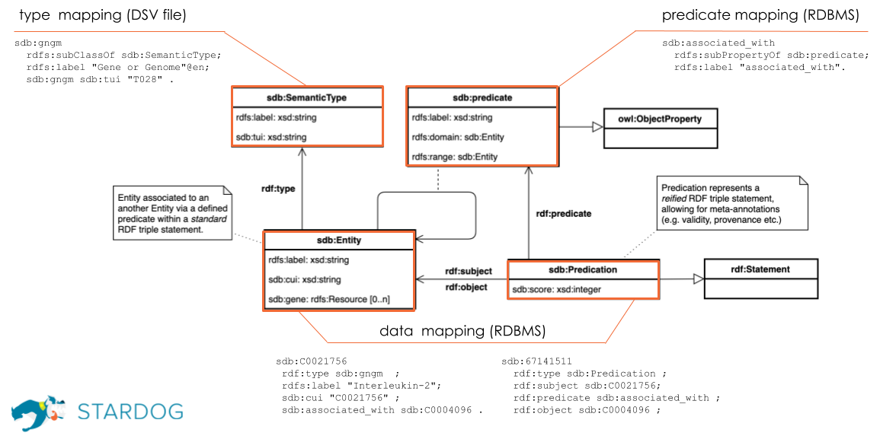
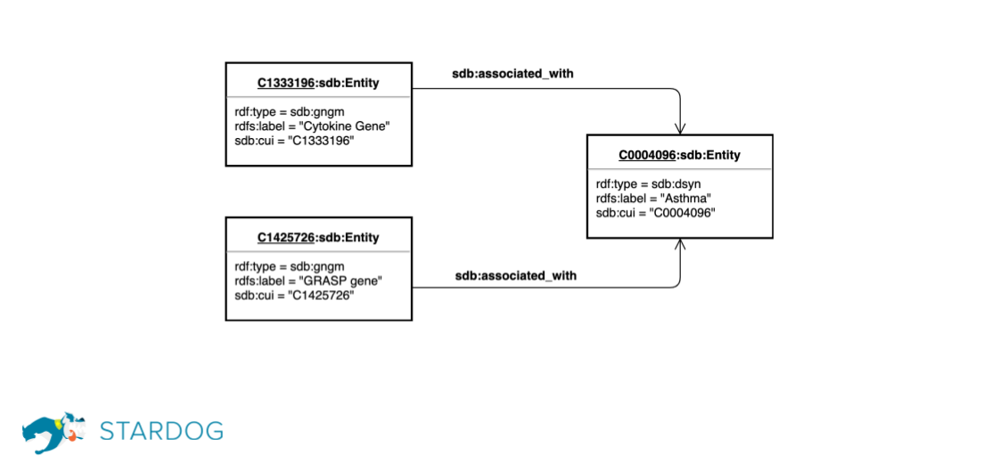

# Overview

This prototype demonstrates the various levels of integrating and exploring the freely available Semantic MEDLINE Database ([SemMedDB](https://skr3.nlm.nih.gov/SemMedDB/index.html)) in Stardog. The database is maintained and annualy updated by the U.S. National Library of Medicine (NLM). SemMedDB is automatically extracted via [SemRep](https://semrep.nlm.nih.gov) by parsing biomedical texts ([PubMed](https://www.ncbi.nlm.nih.gov/pubmed/) citations). As such it may support use cases of relation discovery, hypothesis generation, clinical decision making etc. 

# Resources
- Solutions-internal folder on [SemMedDB](https://paper.dropbox.com/doc/SemMedDB--Alh7lRNqtqjU2XuTsZm9_F6lAg-GhgmPbUj11Q2izuYD4vYD)


# SemMedDB v3 Schema

The primary purpose of SemMedDB  is to capture *RDF-like* ternary relationships between biomedical entities (subject-predicate-object) extracted from scientifc sources. The SemMedDB database consists of [multiple tables](https://skr3.nlm.nih.gov/SemMedDB/dbinfo.html). These collect the  metadata about processed PubMed citations (table `CITATION`), the content of respective citations, i.e. the title or abstract (table `SENTENCE`), a number of formalized statments derived from this input (table `PREDICATION`), and auxiliary information on these predications (table `PREDICATION_AUX`) allowing, e.g., to assess the extraction quality. Table `COREFERENCE` lists the back references (optionally) generated by SemRep with Anaphora resolution. Additional information on entities involved in predications, e.g. their [Entrez Gene](https://www.ncbi.nlm.nih.gov/pmc/articles/PMC3013746/) ID (when applicable), are listed in table `ENTITY`.


# Data Model
This demo focuses on showcasing integration and querying of (relational) biomedical data in Stardog. Considering the central table `PREDICATION` seems sufficient for purposes of this POC. Individual *predications* relate a biomedical *entity* (subject) to another entity (object) by means of a *predicate* such as `AFFECTS` or its negation (`NEG_AFFECTS`), see [Kilicoglu et al.](https://www.researchgate.net/publication/51903378_Constructing_a_semantic_predication_gold_standard_from_the_biomedical_literature) for predicates definitions and [here](predicates.txt) for listing of effectively used predicates. 


Entities at either position are identified by a *concept unique identifier* (CUI) in the column `SUBJECT_CUI` or `OBJECT_CUI`. The most CUIs are atomic strings (`C0039258`) while 
3,28% of subject and 3% of object CUIs comprise a set of pipe-delimited parts, sample:

```
"C0668084"
"C0668084|2011|2149|8856|79581|145624"
"1523|4791|4940|6490|9733|22974|27044|84164"
```

The entities are further described by a readable name (column `SUBJECT_NAME` or `OBJECT_NAME`) and their *semantic type* (column `SUBJECT_SEMTYPE` or `OBJECT_SEMTYPE`). The naming convention apparently follows the CUI format with parts corresponding to positions in compound CUI and the name:

```
"Receptor, PAR-1"
"Receptor, PAR-1|MARK2|F2R|NR1I2|SLC52A2|PWAR1"
"CUX1|NFKB2|OAS3|PMEL|SART3|TPX2|SND1|ASCC2"
```
Depending on the interpretation of these composite identifiers alterantive mappings to Stardog's knowledge graph exist:

1. The CUI is considered an *opaque* identifier, no particular handling appllies 
2. The parts correspond to *aliases* of given (first) entity and should be linked to it, the 
3. The parts correspond to *independent entities*, a new entity resource should be created for each. This approach may require a multi-pass integration

NLM provides a delimiter-separated [file](https://metamap.nlm.nih.gov/Docs/SemanticTypes_2018AB.txt) which is used in the demo to resolve the cryptic [semantic type](https://metamap.nlm.nih.gov/SemanticTypesAndGroups.shtml) identifiers, sample:

```
...
ftcn|T169|Functional Concept
genf|T045|Genetic Function
geoa|T083|Geographic Area
gngm|T028|Gene or Genome
...

```

The target graph model trivially lifts the SemMedDB predication model to RDF. The `Entity` classes are related by instances of the `Predicate` association (derived from `owl:ObjectProperty`):



The following UML object diagram depicts the `poc:associated_with` relation of the Cytokine gene (CUI `C1333196`, semantic type `gngm`, Gene or Genome) and GRASP gene (CUI `C1425726`) to the Asthma disease (CUI `C0004096`, semantic type `dsyn`, Disease or Syndrome):



# POC Environment
The SemMedDB is distributed as individual [MySQL import files](https://skr3.nlm.nih.gov/SemMedDB/download/download.html). An active MySQL instance (8.0.17) and Stardog (7.0.2) with a [MySQL JDBC-driver](https://dev.mysql.com/get/Downloads/Connector-J/mysql-connector-java-8.0.17.zip) installed in `$STARDOG_HOME/server/dbms/` or at `$STARDOG_EXT` are assumed. Please download, unpack and import the SemMedDB [PREDICATION table (2.51Gb)](https://skr3.nlm.nih.gov/SemMedDB/download/semmedVER40_R_PREDICATION.sql.gz) into MySQL:

```sql
mysql>
	CREATE DATABASE semmeddb4 CHARACTER SET utf8mb4 COLLATE utf8mb4_unicode_ci;
	CREATE USER 'tester'@'localhost' IDENTIFIED BY 'stardog';
	GRANT ALL PRIVILEGES ON semmeddb4 . * TO 'tester'@'localhost';
	FLUSH PRIVILEGES;
	USE semmeddb4; 

	# Create indexes to support searching by literals and processing CUIs 
	CREATE INDEX subject_cui_index ON PREDICATION (subject_cui) USING BTREE;
	CREATE INDEX subject_type_index ON PREDICATION (subject_semtype) USING BTREE;
	CREATE INDEX subject_name_index ON PREDICATION (subject_name) USING BTREE;
	CREATE INDEX predicate_index ON PREDICATION (predicate) USING BTREE;
	CREATE INDEX object_cui_index ON PREDICATION (object_cui) USING BTREE;
	CREATE INDEX object_type_index ON PREDICATION (object_semtype) USING BTREE;
	CREATE INDEX object_name_index ON PREDICATION (object_name) USING BTREE;

	# 97.972.561 rows
	SOURCE semmedVER40_R_PREDICATION.sql;

	# Clean up an obviuos error, numeric predicates are inalid (3 rows affected)
	DELETE FROM predication WHERE predicate IN ("127", "1532", "241") ;

```

```
bash>
	# Create database
	stardog-admin db create --name semmeddb --options reasoning.schema.graphs=urn:stardog:demo:semmeddb:model --
	
	# Load ontology file
	stardog data add --format TURTLE --named-graph urn:stardog:demo:semmeddb:model semmeddb model/semmeddb.ttl
	
	# Import extracted type definitions
	stardog-admin virtual import --named-graph urn:stardog:demo:semmeddb:model semmeddb mappings/srdef.properties mappings/srdef.ttl data/SemanticTypes_2018AB.txt
	
	# Import data
	stardog-admin virtual import semmeddb --format SMS2  mappings/semmeddb.properties mappings/semmeddb.sms

```

# Queries
- Identify genes associated with Asthma or COPD
- Identify genes associated with Asthma, but not COPD
	- Chronic obstructive pulmonary disease (COPD)
	- Asthma-COPD overlap syndrome (ACOS)?
 
```
PREFIX sdb: <https://skr3.nlm.nih.gov/SemMedDB/>
PREFIX rdf: <http://www.w3.org/1999/02/22-rdf-syntax-ns#>
PREFIX rdfs: <http://www.w3.org/2000/01/rdf-schema#>

select distinct ?gene_label where {
    #graph <virtual://semmeddb>{
        ?disease 
            rdf:type sdb:dsyn ; # Disease
            rdfs:label ?d_label 
            filter (matches(?d_label, "COPD") || ?d_label = "Asthma")
        ?gene 
            rdf:type sdb:gngm ;# Gene
            sdb:associated_with ?disease ;
            rdfs:label ?gene_label .
  #}
}
```
TBD..


## Summary of data issues

- invalid identifiers (s. predicates)
- multi-valued IDs, should we slplit/unnest them creating new resources?
	- on any position, sbject, object and entity
	- does the type (SUBJECT_SEMTYPE, e.g. Gene) still apply to any of these?
- is resolution of "EntrezGene ID" required (needs to load and  join the Entity table)?
	- values are sometimes missing

